# HELIX Technical Architecture

**System:** HELIX nonclinical report workbench  
**Architecture type:** As-built prototype baseline  
**Status:** Synthetic demonstration — not for submission  
**Last reviewed:** 2026-03-23

> HELIX is a synthetic evidence and report-automation workbench. It demonstrates traceable validation, review, approval, and export patterns; it does **not** claim GLP, 21 CFR Part 11, SEND, eCTD, scientific-validity, or FDA compliance.

## 1. Purpose and scope

HELIX lets a scientist work through one seeded nonclinical study (`STUDY-HLX-028`) from a frozen source manifest to an explicitly released report package. The system supports:

- inspection of authorized source metadata and normalized records;
- deterministic validation, optionally planned by an LLM;
- claim-to-source evidence tracing;
- human disposition of deliberately injected blockers;
- synthetic pathology, peer-review, QAU, and study-director approvals;
- deterministic, checksummed export artifacts;
- one experimental Codex-powered body-weight section-drafting path.

The current implementation is a vertical prototype, not a general sponsor-file ingestion platform. It starts **after** source authorization and manifest lock. Upload, malware scanning, document parsing, mapping, and source quarantine are outside the implemented boundary.

## 2. Architectural principles

1. **One server-owned source of truth.** The backend owns study state, validation outcomes, release gates, approvals, and export eligibility. React holds only transient presentation state.
2. **Deterministic decisions.** Models may propose an allowlisted check, but Python performs calculations and decides pass/fail.
3. **Evidence before narrative.** Claims point to source records through provenance edges; report blocks are assembled from governed package state.
4. **Human judgment remains explicit.** Review dispositions and approvals are separate commands rather than hidden model actions.
5. **Export is an explicit boundary.** Artifacts are generated only after the release gate passes; their exact bytes and SHA-256 digests are stored.
6. **Synthetic claims stay visible.** UI and generated artifacts retain `SYNTHETIC / NOT FOR SUBMISSION` labeling.
7. **Experimental agent output is isolated.** A Codex section candidate is stored for review but cannot enter the principal report or export path.

## 3. System context

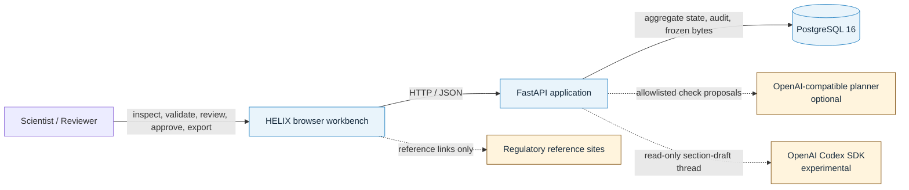

### Trust boundaries

| Boundary | Data crossing it | Current control | Important limitation |
|---|---|---|---|
| Browser → API | Commands, actor labels, study identifiers | Pydantic request validation and CORS | No authentication or authorization |
| API → PostgreSQL | Aggregate state, audit records, immutable bytes | SQLAlchemy transactions and row locks | No migration framework; coarse JSONB writes |
| API → LLM planner | Claims and assembled report blocks | Allowlisted output schema; deterministic execution | Data governance, retention, and regional controls are not implemented |
| API → Codex SDK | Section-scoped execution envelope | Read-only sandbox, schema validation, package gates | No application-level timeout/cancellation; skill qualification is not enforced |
| UI → regulatory sites | User-initiated links | Static URLs | No live regulatory integration or content pinning |

## 4. Deployment architecture

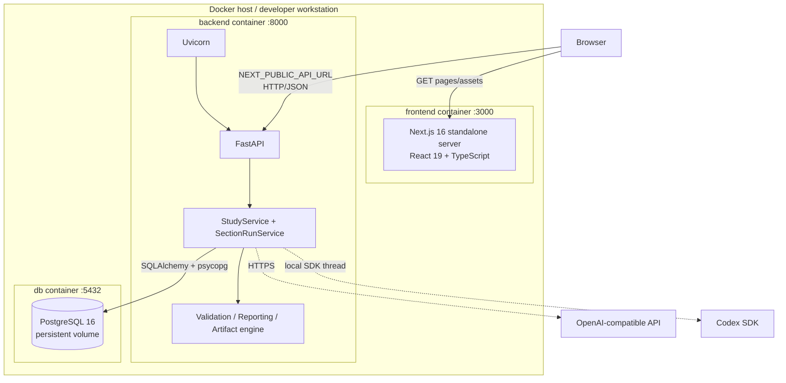

### Runtime services

| Service | Technology | Responsibility | Health/readiness |
|---|---|---|---|
| `frontend` | Node 22, Next.js 16, React 19 | Serves the workbench; makes direct browser-to-API requests | Starts after backend health passes |
| `backend` | Python 3.12+, FastAPI, Uvicorn | API, orchestration, validation, reporting, gates, export, agent execution | `GET /health` checks database connectivity |
| `db` | PostgreSQL 16 | Package state, audit events, run snapshots, section runs, artifact bytes | `pg_isready` |

### Configuration

| Variable | Used by | Purpose |
|---|---|---|
| `HELIX_DATABASE_URL` | Backend | SQLAlchemy database connection |
| `HELIX_CORS_ORIGINS` | Backend | Browser origin allowlist |
| `HELIX_AUTO_SEED` | Backend | Seed the synthetic package during startup |
| `HELIX_SEED_PATH` | Backend | Seed bundle location |
| `HELIX_LLM_BASE_URL` | Backend | Optional OpenAI-compatible planner endpoint |
| `HELIX_LLM_MODEL` | Backend | Planner model identifier |
| `HELIX_LLM_API_KEY` | Backend | Planner credential |
| `HELIX_CODEX_REPOSITORY_ROOT` | Backend | Repository root exposed to section-run logic |
| `NEXT_PUBLIC_API_URL` | Frontend build/browser | Public API base URL |

### Known container packaging gap

The backend image currently copies `backend/app`, `backend/openapi.json`, and `synthetic-e2e`, but section eligibility reads files under `skills/helix-evidence-pipeline`, and Codex execution discovers `.agents/skills/helix-section-agent`. Those paths are not copied by `backend/Dockerfile`. Because workspace assembly calculates section eligibility, a Compose workspace request may fail before an agent run. The image must copy the governed package/contract and skill directories, or those inputs must be packaged as an installable backend dependency.

## 5. Logical component model

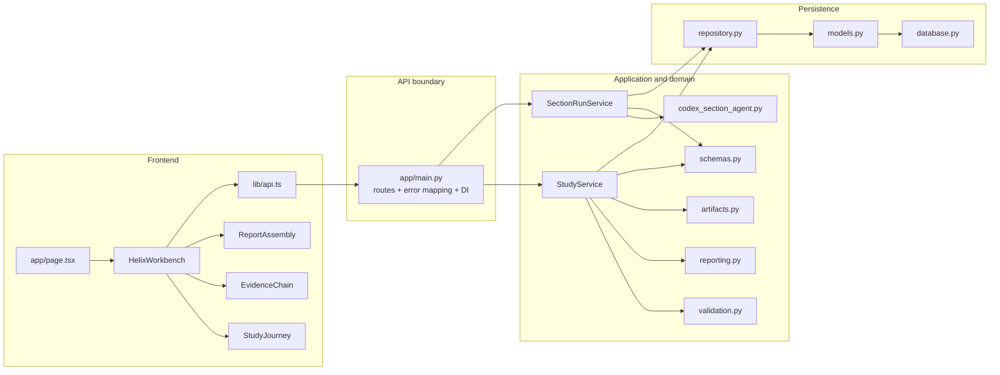

### Frontend components

| Component | File | Responsibility and state |
|---|---|---|
| Page | `frontend/src/app/page.tsx` | Mounts the workbench for hard-coded study `STUDY-HLX-028` |
| Coordinator | `frontend/src/components/HelixWorkbench.tsx` | Loads/refreshes workspace; tracks active view, selected claim, planner, busy, notice, and error state; dispatches commands |
| Study journey | `frontend/src/components/StudyJourney.tsx` | Ten-stage journey, validation controls, and experimental section-run control |
| Evidence chain | `frontend/src/components/EvidenceChain.tsx` | Claim selection, provenance path, exact source records, calculations, and related checks |
| Report assembly | `frontend/src/components/ReportAssembly.tsx` | Report sections, blockers, dispositions, approvals, release gate, export, and downloads |
| API client | `frontend/src/lib/api.ts` | Typed `fetch` wrapper for backend routes |
| API types | `frontend/src/lib/types.ts`, `api-schema.d.ts` | Frontend models generated/derived from OpenAPI |

The frontend does not persist business data, calculate release status, or regenerate artifacts. After each mutation, it refreshes the complete workspace projection.

### Backend components

| Component | File | Responsibility |
|---|---|---|
| API composition | `backend/app/main.py` | App lifespan, schema creation, seed invocation, CORS, routes, dependency creation, domain-to-HTTP error mapping |
| Workflow service | `backend/app/service.py` | Workspace projection, validation orchestration, dispositions, approvals, release derivation, export, evidence lookup |
| Section-run service | `backend/app/section_runs.py` | Eligibility, envelope construction, idempotency, Codex invocation, result validation, review scaffold |
| Validation engine | `backend/app/validation.py` | Planner contract, fixture/LLM planners, deterministic check registry and execution |
| Report assembler | `backend/app/reporting.py` | Loads the template and builds eight current report sections from package state |
| Artifact generator | `backend/app/artifacts.py` | Produces synthetic report PDF, dataset ZIP, illustrative `define.xml`, and nSDRG PDF |
| Domain/API schemas | `backend/app/schemas.py` | Strict Pydantic models for records, evidence, validation, review, release, reporting, and agent execution |
| Agent adapter | `backend/app/agents/codex_section_agent.py` | Starts a read-only Codex thread and invokes the repository skill |
| Repository | `backend/app/repository.py` | Loads/saves aggregate state and run/artifact records; transactions, locks, idempotency |
| ORM | `backend/app/models.py` | SQLAlchemy table mappings |
| Database setup | `backend/app/database.py` | Engine, session factory, and metadata |
| Seeder | `backend/app/seed.py` | Loads and validates the synthetic bundle |

## 6. Domain and persistence model

### Aggregate root

```text
StudyEvidencePackage
├── study
├── manifest[]
├── records{domain -> record[]}
├── claims[]
├── provenance_edges[]
├── validation_results[]
├── report_sections[]
├── review_dispositions[]
├── approvals[]
├── gate_decisions[]
├── export_artifacts[]
└── events[]
```

`StudyEvidencePackage` is loaded and saved as a unit. Command paths lock its row, mutate domain state, recalculate the gate, append history, and commit atomically.

### Storage model

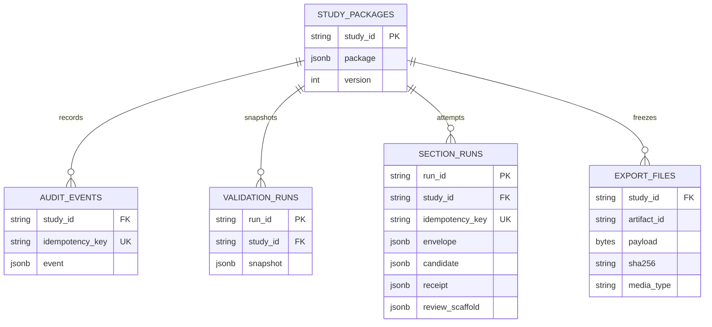

| Store | Semantics |
|---|---|
| `study_packages` | Current package state in PostgreSQL `JSONB`; SQLite JSON in isolated tests |
| `audit_events` | Separate append-style workflow events with idempotency uniqueness |
| `validation_runs` | Immutable snapshots of validation executions |
| `section_runs` | Envelope, candidate, receipt, and review scaffold for agent attempts |
| `export_files` | Exact immutable export bytes and checksums |

The package also embeds workflow events, so two audit representations exist and can diverge. The numeric package version increments on save but is not used as an optimistic-concurrency predicate.

## 7. API surface

Base path: `/api/v1`

| Method | Route | Result / effect |
|---|---|---|
| `GET` | `/health` | Database health and dialect |
| `GET` | `/studies` | Study summaries |
| `GET` | `/studies/{study_id}/workspace` | Complete server-owned UI projection |
| `POST` | `/studies/{study_id}/validation-runs` | Execute fixture- or LLM-planned deterministic validation |
| `POST` | `/studies/{study_id}/section-runs` | Run experimental body-weight section agent |
| `GET` | `/studies/{study_id}/claims/{claim_id}/evidence` | Claim, lineage, source rows, calculation, checks, and report text |
| `POST` | `/studies/{study_id}/validation-results/{result_id}/dispositions` | Resolve a blocking validation result |
| `POST` | `/studies/{study_id}/approvals` | Record a synthetic review/approval role |
| `POST` | `/studies/{study_id}/exports` | Generate and freeze release artifacts |
| `GET` | `/studies/{study_id}/exports/{artifact_id}` | Verify and download frozen bytes |
| `GET` | `/studies/{study_id}/pinned-runs/{run_id}/events` | Server-Sent Events stream of projected run events |

Domain failures map to HTTP `404`, `409`, `422`, or `503`. The generated contract is `backend/openapi.json`.

### Nine-stage journey and run events

`WorkspaceResponse.journey` is the backend-owned nine-stage projection (`upload`, `parse`,
`resolve`, `extract`, `validate`, `draft`, `provenance`, `traceability`, `review-export`) plus
the current Pinned Run identity (`journey.run`). It is derived only from persisted facts, so a
reload restores the same stages and actions. The legacy ten-entry `stages` array is unchanged
and is not the journey. Governance rules: Upload stays current until a Pinned Run is frozen;
agent steps never complete Traceability review or Review and export; dispositioned blockers
report outcome `dispositioned`, never `passed`; approvals can make export ready but only
`POST /exports` completes the final stage. With zero blockers, Traceability review stays
current because no explicit traceability-approval command exists yet.

Two event records exist and must not be confused:

- `WorkspaceResponse.events` is the append-only **audit history** (latest 20 workflow events).
- `GET /studies/{study_id}/pinned-runs/{run_id}/events` is the **live run-event stream**
  (`stage_started`, `action_started`, `action_finished`, `stage_finished`, `run_paused`,
  `run_resumed`, `gate_reached`, `command_failed`, `export_finished`). Each event has a stable
  `event_id` (`{run_id}.E{sequence}`), `run_id`, projected `stage_id`, timestamp, and sequence.
  Events are appended after a command commits, by diffing the projection against the last
  recorded state, so they report only persisted transitions. `Last-Event-ID` (header or
  `last_event_id` query) replays only missed events; a cursor outside the retained window
  returns HTTP `409` `event_cursor_expired` with the run version and latest event ID, and the
  client refreshes `GET /workspace` and reconnects (`frontend/src/lib/runEvents.ts`).
  `run_paused` and `run_resumed` are part of the contract; the commands that emit them are owned
  by a later slice.

All journey and event payloads carry the `SYNTHETIC / NOT FOR SUBMISSION` label.

## 8. Core runtime flows

### 8.1 Startup and seed

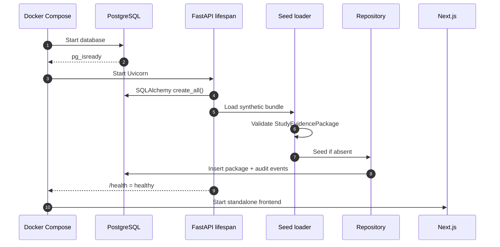

### 8.2 Workspace load

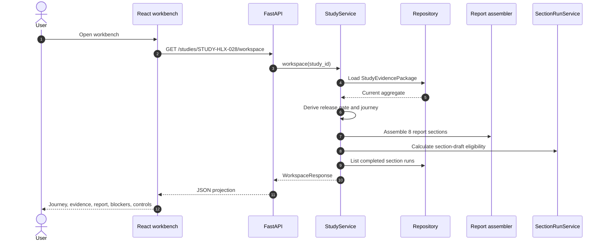

The workspace is a coarse projection: one request returns the current state needed by all principal views.

### 8.3 Hybrid validation

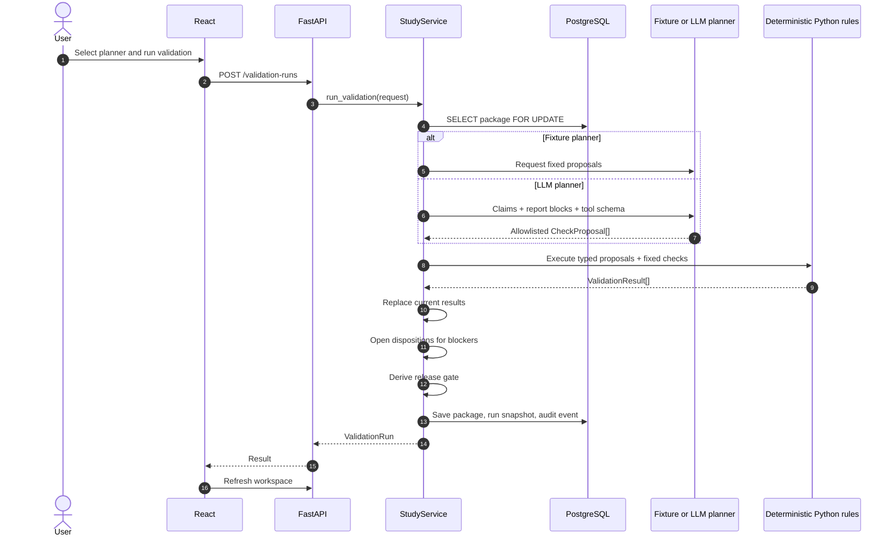

The model never performs the authoritative calculation, creates a new rule, changes severity, or turns a failure green.

### 8.4 Evidence inspection

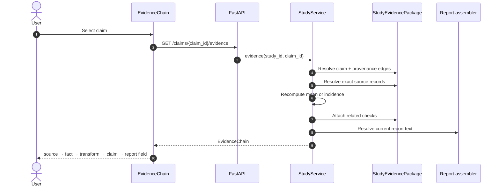

### 8.5 Blocker disposition

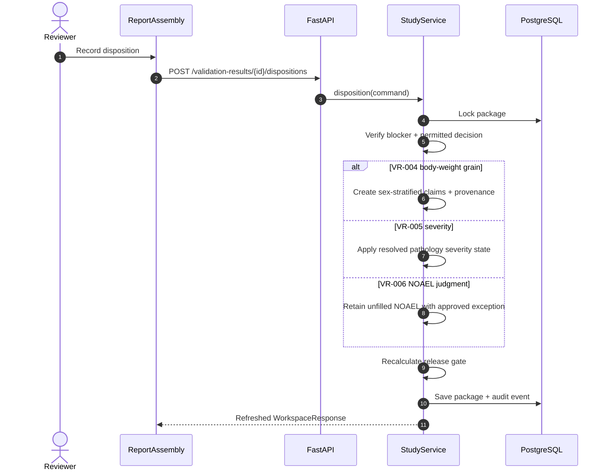

These result-ID branches are prototype-specific and must become governed executor configuration before multi-study use.

### 8.6 Approvals and release state

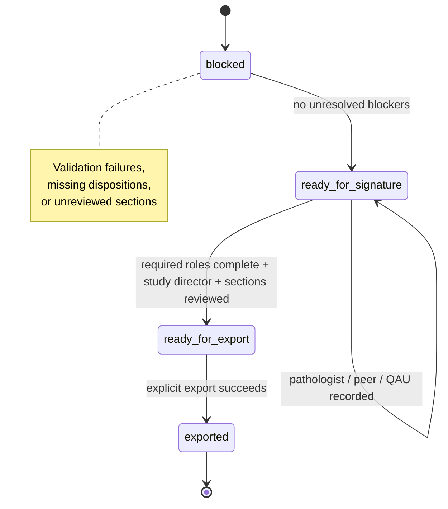

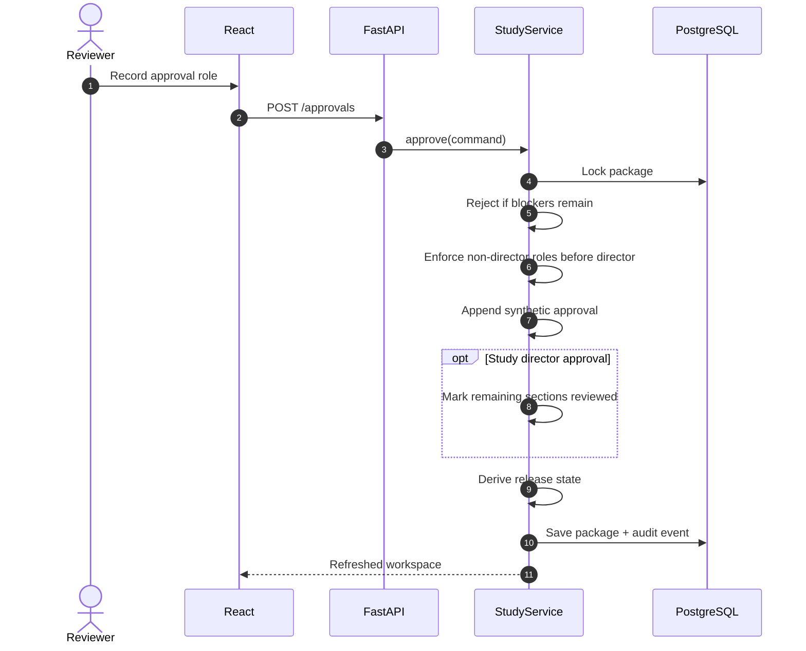

### 8.7 Explicit export and download

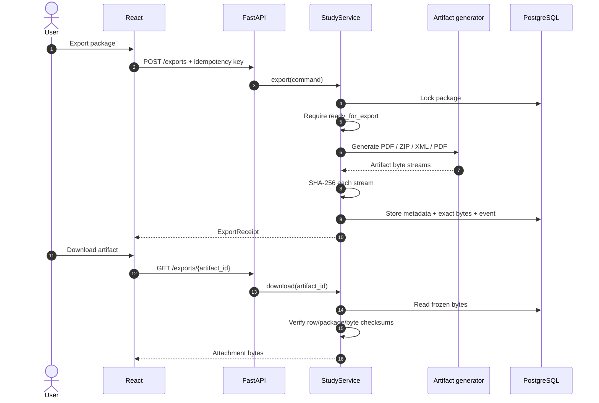

Downloaded artifacts are never regenerated after release.

### 8.8 Experimental Codex section draft

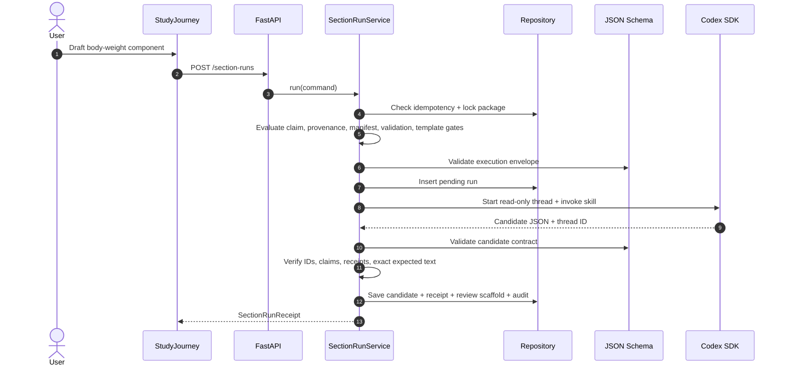

```text
Principal report path                 Experimental path
package state                         execution envelope
    ↓                                     ↓
report assembler                      Codex section agent
    ↓                                     ↓
reviewed report sections              SectionDraftCandidate
    ↓                                     ↓
release gate → export                 stored review scaffold
                                          ✕ no promotion
                                          ✕ no export effect
```

The experimental candidate does not update `report_sections`, enter `assemble_report`, alter the gate, or appear in export output.

## 9. Validation and reporting boundaries

### Planner contract

```text
planner input
  study summary
  claims
  assembled report blocks
  allowlisted tool descriptions

planner output
  CheckProposal[]
    grounded_numeric_claim(claim_id)
    source_severity_match(claim_id)
    human_judgment_required(claim_id)

execution
  typed proposal → deterministic Python function → ValidationResult
```

Fixed checks also cover synthetic labeling, manifest lock, body-weight keys, numeric reconciliation, provenance, sex-stratified grain, pathology severity, human NOAEL judgment, template coverage, and output slots.

### Report assembly

`backend/app/data/report-template.json` defines eight sections and 37 required fields, including field grain, source expectations, human-judgment markers, output slots, and regulatory references. `reporting.py` renders current package state and deliberately retains `[NEEDS REVIEW]` markers until workflow state supports replacement.

### Generated artifacts

| Artifact | Implementation | Intended demonstration | Not claimed |
|---|---|---|---|
| Study report PDF | Internal minimal PDF writer | Deterministic report packaging | Submission-grade publishing |
| Dataset ZIP | Domain CSVs + lineage/audit JSON | Data, provenance, and audit packaging | SEND XPT |
| `define.xml` | Illustrative XML | Metadata packaging | Conformant define.xml |
| nSDRG PDF | Internal PDF writer | Review-guide packaging | Submission readiness |

## 10. Security, compliance, and governance posture

### Implemented safeguards

- Strict Pydantic models reject unknown fields.
- Database transactions and row locks protect command paths in PostgreSQL.
- Idempotency keys protect export, audit, and section-run operations.
- Agent execution uses a read-only sandbox and section-scoped envelope.
- Candidate and envelope schemas are validated.
- Frozen artifacts are verified by SHA-256 before download.
- The release gate is server-derived.
- Synthetic labeling is checked and preserved.

### Explicit gaps

- No login, identity provider, access control, tenant isolation, or study-level authorization.
- Actor and reviewer names are client-supplied labels, not authenticated identities.
- Approvals are workflow records, not electronic signatures.
- Approvals are not bound to exact report or artifact hashes.
- Later validation can change state without generalized approval invalidation.
- No secrets manager, key rotation, model egress policy, prompt retention control, or region enforcement.
- No API rate limiting, agent cancellation, or explicit Codex application timeout.
- No formal audit reconciliation between embedded and relational events.
- No migration framework or documented backup/restore procedure.

## 11. Verification architecture

| Layer | Coverage | Entry point |
|---|---|---|
| Domain/API | Seed invariants, validation rules, API workflow, review and export | `backend/tests/test_seed.py`, `test_validation.py`, `test_api.py` |
| Agent contract | Eligibility, rollback, idempotency, invalid candidates, mocked failures | `backend/tests/test_section_runs.py` |
| Frontend E2E | Validation-to-export browser flow | `frontend/tests/workbench.spec.ts` |
| Live Codex proof | Real SDK thread and receipt | `frontend/tests/codex-section-run.spec.ts` |
| Local verification | SQLite-backed browser flow | `scripts/verify-live.sh` |
| PostgreSQL verification | Product storage, release, checksum/download assertions | `scripts/verify-postgres.sh` |
| Live agent verification | Real Codex section execution | `scripts/verify-codex-section-run.sh` |
| Static/build suite | Backend tests, frontend checks, generated contract, production build | `make test` |

`make test` does not run the Playwright suite or live Codex proof. Live Codex testing is opt-in through `HELIX_CODEX_LIVE=1`.

## 12. As-built versus target architecture

The architecture and ADR documents describe a broader governed pipeline than the current implementation. Keep these states distinct:

| Capability | As built | Target/design vocabulary |
|---|---|---|
| Study scope | One seeded study | Multi-study ingestion and execution |
| Source intake | Pre-authorized static bundle | Governed upload, quarantine, parse, map, freeze |
| Package execution | One body-weight package | Dependency DAG of independently executable packages |
| Agent output | Stored draft candidate only | Review, promotion, supersession, and reuse |
| Run identity | Current aggregate + run rows | Fully pinned immutable run plans and dependency fingerprints |
| Approvals | Role/order workflow records | Authenticated, artifact-bound signatures |
| Audit | Embedded events + relational rows | One reconciled, append-only audit authority |
| Release output | Illustrative synthetic files | Validated SEND/eCTD-ready package |

## 13. Architectural risks and recommendations

### Priority 0 — make the documented deployment runnable

1. Package `skills/helix-evidence-pipeline` and `.agents/skills/helix-section-agent` into the backend image, or move runtime contracts/package definitions into an installable backend resource module.
2. Add a Compose smoke test that loads `/workspace`, not only `/health`.
3. Pin and record the authoritative repository, branch, and commit; duplicate checkouts currently differ.

### Priority 1 — protect workflow integrity

1. Add authentication and role-based authorization before any real-user trial.
2. Bind approvals to report/package hashes and invalidate them when governed inputs change.
3. Replace client-supplied actor identity with authenticated principal data.
4. Enforce package/skill qualification status before agent invocation.
5. Add agent timeout, cancellation, retry classification, and model-call observability.

### Priority 2 — support evolution

1. Introduce Alembic migrations and a schema/version compatibility policy.
2. Decide on one audit authority or add invariant checking between both representations.
3. Convert hard-coded study/result/claim identifiers into governed registries and package executors.
4. Add optimistic version checks or retain row locking with explicit concurrency tests.
5. Normalize only the records required by demonstrated cross-study query workloads.
6. Separate large immutable source records and artifacts from frequently rewritten package state as scale grows.

### Priority 3 — production and regulatory readiness

1. Design the real ingestion/authorization boundary.
2. Establish data classification, approved model endpoints, retention/redaction policy, and prompt/response audit.
3. Integrate qualified terminology and SEND validation tooling.
4. Replace illustrative PDF/XML/CSV generators with validated publishing and submission pipelines.
5. Perform formal GLP, Part 11, privacy, security, and records-management assessments; do not infer compliance from prototype controls.

## 14. Key source map

```text
helix-prototypes/
├── compose.yaml                         # local three-service topology
├── backend/
│   ├── app/
│   │   ├── main.py                      # HTTP boundary and composition root
│   │   ├── service.py                   # workflow and release orchestration
│   │   ├── section_runs.py              # experimental agent orchestration
│   │   ├── validation.py                # planners and deterministic checks
│   │   ├── reporting.py                 # report assembly
│   │   ├── artifacts.py                 # export byte generation
│   │   ├── schemas.py                   # strict domain/API contracts
│   │   ├── repository.py                # persistence interface/transactions
│   │   ├── models.py                    # SQLAlchemy rows
│   │   ├── database.py                  # engine and sessions
│   │   ├── seed.py                      # synthetic seed loader
│   │   ├── agents/codex_section_agent.py
│   │   └── data/report-template.json
│   └── tests/                           # API, domain, seed, and agent tests
├── frontend/
│   ├── src/app/page.tsx                 # study entry point
│   ├── src/components/HelixWorkbench.tsx
│   ├── src/components/StudyJourney.tsx
│   ├── src/components/EvidenceChain.tsx
│   ├── src/components/ReportAssembly.tsx
│   ├── src/lib/api.ts
│   └── tests/                           # Playwright flows
├── skills/helix-evidence-pipeline/      # packages and JSON contracts
├── .agents/skills/helix-section-agent/  # Codex skill instructions
├── synthetic-e2e/                       # canonical synthetic bundle
├── scripts/                             # verification entry points
└── docs/                                # architecture, ADRs, implementation, research
```

## 15. Architecture decisions summarized

| Decision | Rationale | Tradeoff |
|---|---|---|
| Store one JSONB aggregate | Preserves supplied domain shape; enables rapid prototype changes and atomic commands | Coarse reads/writes and weaker relational queryability |
| Separate event/run/artifact tables | Idempotency, history, and immutable bytes need independent constraints | Duplicated audit representations |
| Browser calls FastAPI directly | Simple local deployment and transparent API boundary | Public API URL is build-time browser configuration |
| Server derives release gate | Prevents client-side authority and state drift | Coarse workspace refresh after commands |
| LLM plans, Python decides | Allows model experimentation without delegating authoritative checks | Planner adds latency and data-egress concerns |
| Store exact exported bytes | Stable checksums and reproducible downloads | Database growth; future object-storage seam needed |
| Isolate Codex candidate | Keeps experimental generation out of governed release output | No end-to-end agent contribution yet |

---

## Document maintenance

Update this baseline when any of the following change:

- API paths or OpenAPI contract;
- domain aggregate or database tables;
- release-gate logic or approval ordering;
- model/agent boundaries;
- report template, package contracts, or artifact formats;
- container topology or runtime configuration;
- security, identity, audit, or compliance controls.
